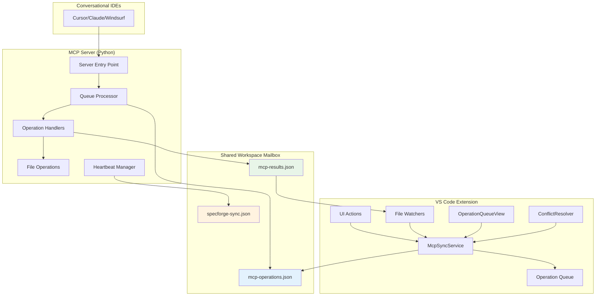
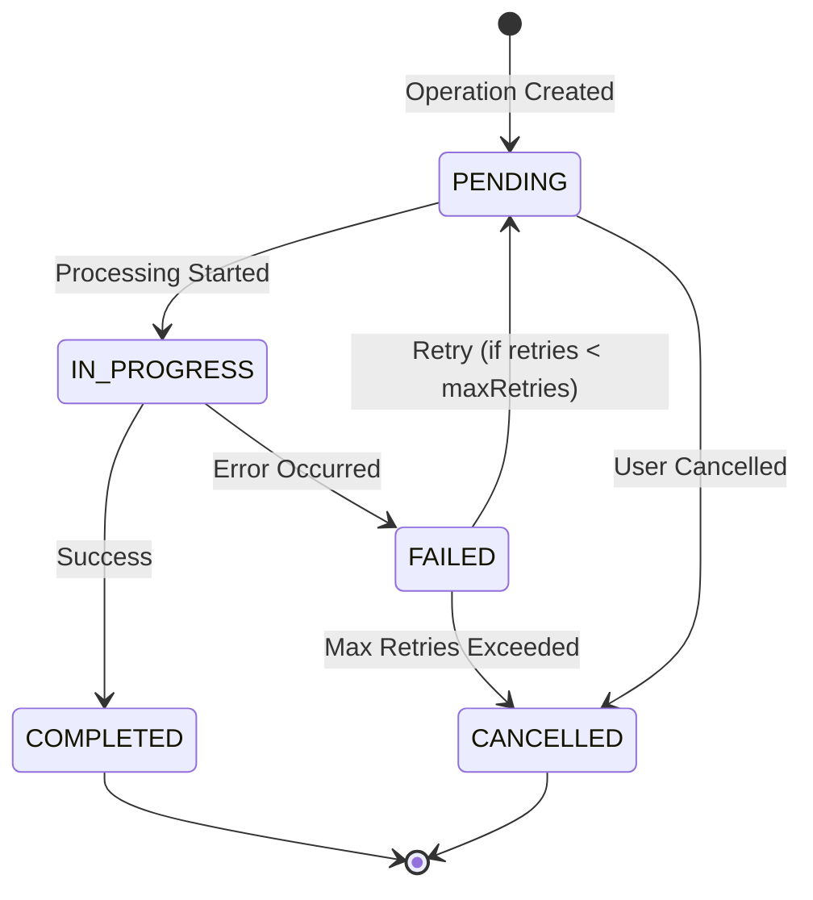

# Design Document

## Overview

The Unified MCP Ecosystem design transforms SpecForged from a fragile direct-configuration approach to a robust, file-based asynchronous communication system. This architecture decouples the VS Code extension from direct MCP server control, using a shared "mailbox" system within the user's project workspace for bidirectional communication.

The system enables seamless operation where the VS Code extension can initiate operations that are processed by the MCP server during its next invocation, creating a magical user experience while maintaining architectural robustness and eliminating dependencies on other IDEs' configuration formats.

## Architecture

### High-Level Architecture



### Communication Flow

The system operates on an asynchronous, file-based communication pattern:

1. **Extension → Server**: Operations written to `mcp-operations.json`
2. **Server → Extension**: Results written to `mcp-results.json`
3. **Bidirectional Status**: Heartbeat information in `specforge-sync.json`

### File-Based IPC Protocol

#### Operation Queue File (`mcp-operations.json`)
```json
{
  "operations": [
    {
      "id": "op-1704067200000-abc123",
      "type": "create_spec",
      "status": "pending",
      "priority": 1,
      "timestamp": "2024-01-01T00:00:00.000Z",
      "source": "extension",
      "retryCount": 0,
      "maxRetries": 3,
      "params": {
        "name": "User Authentication",
        "description": "OAuth2 integration",
        "specId": "user-auth"
      }
    }
  ],
  "version": 1,
  "lastProcessed": "2024-01-01T00:00:00.000Z"
}
```

#### Results File (`mcp-results.json`)
```json
{
  "results": [
    {
      "operationId": "op-1704067200000-abc123",
      "success": true,
      "message": "Specification created successfully",
      "data": {
        "specId": "user-auth",
        "filesCreated": ["requirements.md", "design.md", "tasks.md"]
      },
      "timestamp": "2024-01-01T00:01:00.000Z"
    }
  ],
  "lastUpdated": "2024-01-01T00:01:00.000Z"
}
```

#### Sync State File (`specforge-sync.json`)
```json
{
  "extensionOnline": true,
  "mcpServerOnline": true,
  "lastSync": "2024-01-01T00:01:00.000Z",
  "pendingOperations": 0,
  "failedOperations": 0,
  "syncErrors": [],
  "specifications": [
    {
      "specId": "user-auth",
      "lastModified": "2024-01-01T00:01:00.000Z",
      "version": 1
    }
  ]
}
```

## Components and Interfaces

### VS Code Extension Components

#### Enhanced McpSyncService
**Location**: `src/services/mcpSyncService.ts`

**Responsibilities**:
- Manage file-based operation queue
- Process operation results from MCP server
- Maintain heartbeat and sync state
- Handle file watchers for real-time updates
- Coordinate with ConflictResolver for conflict detection

**Key Methods**:
```typescript
class McpSyncService {
  async queueOperation(operation: McpOperation): Promise<void>
  async processOperations(): Promise<void>
  async notifySpecificationChange(specId: string, changeType: string): Promise<void>
  getSyncState(): McpSyncState
  getOperationQueue(): McpOperationQueue
}
```

#### Enhanced ConflictResolver
**Location**: `src/utils/conflictResolver.ts`

**Responsibilities**:
- Detect operation conflicts (concurrent modifications)
- Provide automatic resolution for simple conflicts
- Present user interface for manual conflict resolution
- Maintain conflict history and resolution patterns

**Key Methods**:
```typescript
class ConflictResolver {
  detectConflicts(operation: McpOperation, queue: McpOperationQueue): Conflict[]
  resolveConflict(conflict: Conflict, resolution: ConflictResolution): Promise<void>
  getActiveConflicts(): Conflict[]
}
```

#### Enhanced OperationQueueView
**Location**: `src/views/operationQueueView.ts`

**Responsibilities**:
- Display operations grouped by status (Pending, In Progress, Failed, Completed)
- Show real-time updates as operations are processed
- Provide user actions for retry, cancel, and conflict resolution
- Display sync state and server connectivity status

**Tree Structure**:
```
MCP Operations
├── 📋 Pending (2)
│   ├── Create Specification: User Auth
│   └── Update Task Status: Login Flow
├── ⚙️ In Progress (1)
│   └── Update Requirements: Payment System
├── ❌ Failed (1)
│   └── Delete Specification: Old Feature
├── ✅ Completed (5)
│   └── [Show last 5 completed operations]
└── ⚠️ Conflicts (1)
    └── Concurrent modification: user-auth/requirements.md
```

#### Enhanced Operation Models
**Location**: `src/models/mcpOperation.ts`

**Enhanced Features**:
- Comprehensive operation type definitions
- Priority-based processing
- Retry logic with exponential backoff
- Operation validation and sanitization
- Conflict detection metadata

### MCP Server Components

#### Queue Processor
**Location**: `src/specforged/core/queue_processor.py`

**Responsibilities**:
- Check for pending operations on server startup
- Process operations in priority order
- Write results back to results file
- Handle operation failures and retries
- Maintain server heartbeat

**Key Methods**:
```python
class QueueProcessor:
    async def process_operation_queue(self) -> None
    async def process_operation(self, operation: dict) -> dict
    async def write_operation_result(self, result: dict) -> None
    async def update_heartbeat(self) -> None
```

#### Enhanced Server Entry Point
**Location**: `src/specforged/server.py`

**Modifications**:
- Initialize queue processor on server startup
- Process operation queue before handling MCP requests
- Maintain server online status in sync file
- Handle graceful shutdown with cleanup

## Data Models

### Operation Types
```typescript
enum McpOperationType {
  CREATE_SPEC = 'create_spec',
  UPDATE_REQUIREMENTS = 'update_requirements',
  UPDATE_DESIGN = 'update_design',
  UPDATE_TASKS = 'update_tasks',
  ADD_USER_STORY = 'add_user_story',
  UPDATE_TASK_STATUS = 'update_task_status',
  DELETE_SPEC = 'delete_spec',
  SET_CURRENT_SPEC = 'set_current_spec',
  SYNC_STATUS = 'sync_status',
  HEARTBEAT = 'heartbeat'
}
```

### Operation Status Lifecycle


### Conflict Types
```typescript
enum ConflictType {
  CONCURRENT_MODIFICATION = 'concurrent_modification',
  DUPLICATE_OPERATION = 'duplicate_operation',
  RESOURCE_LOCKED = 'resource_locked',
  DEPENDENCY_CONFLICT = 'dependency_conflict',
  VERSION_MISMATCH = 'version_mismatch'
}
```

## Error Handling

### Atomic File Operations
All file operations use atomic write patterns to prevent corruption:

```typescript
async function atomicWrite(filePath: string, content: string): Promise<void> {
  const tempPath = `${filePath}.tmp`;
  try {
    await vscode.workspace.fs.writeFile(
      vscode.Uri.file(tempPath),
      new TextEncoder().encode(content)
    );
    await vscode.workspace.fs.rename(
      vscode.Uri.file(tempPath),
      vscode.Uri.file(filePath)
    );
  } catch (error) {
    // Cleanup temp file on failure
    try {
      await vscode.workspace.fs.delete(vscode.Uri.file(tempPath));
    } catch {}
    throw error;
  }
}
```

### Retry Logic with Exponential Backoff
```typescript
class RetryManager {
  static calculateDelay(retryCount: number): number {
    return Math.min(1000 * Math.pow(2, retryCount), 30000); // Max 30 seconds
  }

  static shouldRetry(operation: McpOperation): boolean {
    return operation.retryCount < operation.maxRetries &&
           operation.status === McpOperationStatus.FAILED;
  }
}
```

### Error Recovery Strategies

1. **File Corruption**: Backup and restore from previous valid state
2. **Network Issues**: Queue operations for later processing
3. **Permission Errors**: Provide clear user guidance and fallback options
4. **JSON Parse Errors**: Attempt repair or reinitialize with empty state
5. **Workspace Changes**: Detect and adapt to new workspace structure

## Testing Strategy

### Unit Testing

#### VS Code Extension Tests
**Framework**: Jest with VS Code Test Runner

**Test Categories**:
- McpSyncService operation queuing and processing
- ConflictResolver conflict detection and resolution
- OperationQueueView tree data provider functionality
- File watcher event handling
- Atomic file operation reliability

**Example Test**:
```typescript
describe('McpSyncService', () => {
  it('should queue operations with proper validation', async () => {
    const service = new McpSyncService(mockFileService);
    const operation = McpOperationFactory.createCreateSpecOperation(
      'Test Spec', 'Description'
    );

    await service.queueOperation(operation);

    const queue = service.getOperationQueue();
    expect(queue.operations).toHaveLength(1);
    expect(queue.operations[0].status).toBe(McpOperationStatus.PENDING);
  });
});
```

#### MCP Server Tests
**Framework**: pytest with asyncio support

**Test Categories**:
- Queue processor operation handling
- File-based IPC protocol compliance
- Error handling and recovery
- Heartbeat and sync state management
- Integration with existing SpecManager

**Example Test**:
```python
@pytest.mark.asyncio
async def test_queue_processor_handles_create_spec():
    processor = QueueProcessor(spec_manager)
    operation = {
        "id": "test-op-123",
        "type": "create_spec",
        "params": {"name": "Test Spec", "specId": "test-spec"}
    }

    result = await processor.process_operation(operation)

    assert result["success"] is True
    assert "test-spec" in result["data"]["specId"]
```

### Integration Testing

#### End-to-End Workflow Tests
1. **Extension Operation → Server Processing → Result Notification**
2. **Conflict Detection → User Resolution → Operation Retry**
3. **Server Offline → Operation Queuing → Batch Processing on Reconnect**
4. **File System Changes → Sync State Updates → UI Refresh**

#### Cross-Platform Compatibility
- Test file operations on Windows, macOS, and Linux
- Verify file watcher behavior across platforms
- Validate path handling and permissions

### Performance Testing

#### Load Testing
- Queue 100+ operations and measure processing time
- Test file watcher performance with rapid file changes
- Measure memory usage during extended operation

#### Stress Testing
- Simulate network interruptions during file operations
- Test behavior with corrupted queue files
- Validate recovery from workspace folder changes

## Security Considerations

### File System Security
- Restrict file operations to workspace directory
- Validate all file paths to prevent directory traversal
- Use secure temporary file creation for atomic operations

### Operation Validation
- Sanitize all operation parameters
- Validate operation types and required fields
- Implement rate limiting for operation queuing

### Data Privacy
- No sensitive data in operation queue files
- Clear operation history on workspace close
- Respect VS Code's privacy settings

## Performance Optimizations

### File Operation Batching
- Batch multiple file operations into single atomic writes
- Debounce rapid file watcher events
- Use efficient JSON parsing with streaming for large files

### Memory Management
- Limit operation queue size (max 1000 operations)
- Implement LRU cache for frequently accessed operations
- Clean up completed operations older than 24 hours

### Network Efficiency
- Compress large operation payloads
- Implement delta sync for specification changes
- Use efficient polling intervals for heartbeat

## Deployment Strategy

### Phase 1: Foundation (Week 1-2)
- Implement enhanced data models and validation
- Create core McpSyncService with file operations
- Set up basic operation queuing and processing

### Phase 2: UI Integration (Week 3-4)
- Develop OperationQueueView with real-time updates
- Implement ConflictResolver with user interface
- Refactor existing commands to use operation queue

### Phase 3: Server Integration (Week 5-6)
- Modify MCP server to process operation queue
- Implement heartbeat and sync state management
- Add comprehensive error handling and recovery

### Phase 4: Testing and Polish (Week 7-8)
- Comprehensive testing suite implementation
- Performance optimization and stress testing
- Documentation updates and user guides

## Migration Strategy

### Backward Compatibility
- Maintain existing MCP tool interfaces during transition
- Provide fallback to direct operation mode if file-based system fails
- Gradual migration of commands from direct to queued operations

### User Communication
- Clear documentation of new architecture benefits
- Migration guide for existing users
- Troubleshooting guide for common issues

### Rollback Plan
- Feature flag to disable file-based operations
- Automatic fallback to previous behavior on critical errors
- User setting to opt-out of new architecture if needed
