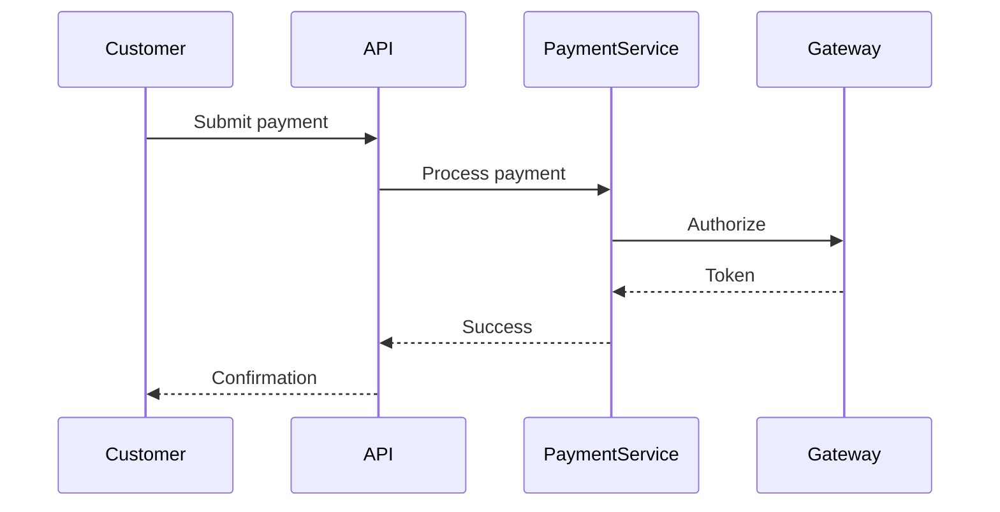

# SpecForge MCP Server

[](https://pypi.org/project/specforged/)
[](https://pypi.org/project/specforged/)
[](https://github.com/whit3rabbit/SpecForge/actions/workflows/test.yml)

A Model Context Protocol (MCP) server that implements specification-driven development with EARS notation, intelligent mode classification, and structured workflow management.

## Quick Start

🎉 **SpecForge is now available on [PyPI](https://pypi.org/project/specforged/)!**

### Quick Installation

```bash
# Install SpecForge globally with pipx
pipx install specforged

# Verify installation
specforged --version
```

**Choose your integration method:**

- 🔥 **[Claude Code](#claude-code-recommended-for-coding)** - Best for active development and coding
- 🔧 **[Other IDEs](#cursor-ide)** - Cursor, Windsurf, VS Code with AI extensions  
- 💬 **[Claude Desktop](#claude-desktop-configuration)** - For chat-based specification work
- 🐳 **[Docker](#docker-with-bind-mounts)** - Containerized deployment

#### Available Commands

- `specforged`: Run MCP server (default)
- `specforged-http`: Run HTTP server for web integration  
- `specforged-cli`: CLI with subcommands (mcp/http modes)

#### Management

```bash
# Upgrade to latest version
pipx upgrade specforged

# Uninstall
pipx uninstall specforged
```

## Installation for Development

⚠️ **Important**: For local development work, you need MCP servers that can write to your project files. HTTP-based deployments run on remote servers and cannot write to your local project directories.

### Claude Code (Recommended for Coding)

The best way to use SpecForge for development is with Claude Code and pipx:

```bash
# Install SpecForge globally with pipx
pipx install specforged

# Add to Claude Code with project scope (enables team sharing)
claude mcp add --scope=project specforged specforged

# Or for personal use only
claude mcp add specforged specforged
```

**Why project scope?** Creates a `.mcp.json` file in your project root that team members can share:
```json
{
  "mcpServers": {
    "specforged": {
      "command": "specforged",
      "args": [],
      "env": {}
    }
  }
}
```

**File System Access**: Claude Code will prompt for permission to write specification files to your project directory.

### Cursor IDE

For Cursor users, configure SpecForge as an MCP server:

1. Install with pipx: `pipx install specforged`
2. Add to Cursor's MCP configuration in settings
3. Restart Cursor to load the server

### Windsurf IDE

Windsurf users can integrate SpecForge similarly:

1. Install: `pipx install specforged`
2. Configure in Windsurf's MCP settings
3. Enable local file system access

### VS Code with AI Extensions

For VS Code with Continue, Codeium, or similar extensions:

1. Install: `pipx install specforged`
2. Configure MCP server in your AI extension settings
3. Ensure the extension has workspace file permissions

## Claude Desktop Configuration

**Note**: Claude Desktop is designed for chat interfaces, not active development. For coding work, use Claude Code or other development-focused IDEs above.

### Standard Claude Desktop Setup

```bash
# Install SpecForge globally with pipx
pipx install specforged
```

Configure in Claude Desktop:

**macOS**: `~/Library/Application Support/Claude/claude_desktop_config.json`  
**Windows**: `%APPDATA%\Claude\claude_desktop_config.json`  
**Linux**: `~/.config/Claude/claude_desktop_config.json`

```json
{
  "mcpServers": {
    "specforged": {
      "command": "specforged"
    }
  }
}
```

## Advanced Installation Methods

### Docker with Bind Mounts

For Docker users who want to persist specifications locally:

```bash
# Build the Docker image
docker build -t specforged:latest .
```

Configure in Claude Desktop with bind mount:

```json
{
  "mcpServers": {
    "specforged": {
      "command": "docker",
      "args": [
        "run", "-i", "--rm",
        "--mount", "type=bind,src=/absolute/path/to/host/specifications,dst=/app/specifications",
        "specforged:latest",
        "python", "main.py"
      ]
    }
  }
}
```

**Notes:**
- Container writes to `/app/specifications` which maps to your local directory
- Specifications persist on your local machine
- Restart Claude Desktop after configuration changes

### Manual Development Installation

For development or local testing without pipx:

```bash
# Clone the repository
git clone https://github.com/whit3rabbit/SpecForge.git
cd SpecForge

# Install dependencies
pip install -r requirements.txt

# Test locally
python main.py
```

Configure in Claude Desktop:

```json
{
  "mcpServers": {
    "specforged": {
      "command": "python",
      "args": ["/absolute/path/to/SpecForge/main.py"]
    }
  }
}
```

## Example

```bash
Use specforged to create a spec for a TODO list app that supports creating, editing, completing, and filtering tasks.
```

## Overview

SpecForge transforms ad-hoc development into a structured process by:
- **Classifying intent** - Routes requests to appropriate handlers (spec mode vs. action mode)
- **Enforcing workflow** - Guides through requirements → design → tasks → execution phases
- **Using EARS notation** - Creates unambiguous, testable requirements
- **Managing artifacts** - Maintains requirements.md, design.md, and tasks.md files

## Background

This server implements the EARS (Easy Approach to Requirements Syntax) notation, developed by Alistair Mavin et al. at Rolls-Royce (2009). EARS is an industry-standard methodology for writing clear, testable requirements, widely used in aerospace, automotive, and safety-critical systems.

## Features

### Intelligent Mode Classification
Automatically determines user intent and routes to appropriate handler:
- **Spec Mode**: Creating specifications, requirements, design documents
- **Do Mode**: Code modifications, commands, implementation tasks  
- **Chat Mode**: Questions, explanations, general discussion

### Complete Specification Workflow

#### Requirements Phase
- User stories: "As a [user], I want [goal], so that [benefit]"
- EARS acceptance criteria: "WHEN [condition] THE SYSTEM SHALL [response]"
- Structured requirement tracking with unique IDs

#### Design Phase
- Technical architecture documentation
- Component specifications
- Data models and interfaces
- Sequence diagrams (Mermaid format)
- API contracts and schemas

#### Task Planning
- Discrete, trackable implementation tasks
- Dependency management
- Progress tracking (pending → in_progress → completed)
- Links to requirements for traceability

#### Execution Phase
- Individual task execution with validation
- Real-time status updates
- Progress reporting

### File Management
Automatically generates and maintains three key files per specification:
```
specifications/
└── your-feature/
    ├── spec.json          # Specification metadata
    ├── requirements.md    # User stories & EARS criteria
    ├── design.md         # Technical architecture
    └── tasks.md          # Implementation plan
```

## Usage

### Creating a Specification

```
User: Create a spec for user authentication system
Response: Creates new specification with requirements.md, design.md, and tasks.md files
```

You can also explicitly reference SpecForge in your request. The classifier now recognizes the trigger word:

```
User: Use specforged to generate a spec for payment processing
Response: Routes to spec mode and creates the specification scaffold
```

### Mode Classification Examples

```python
# Spec mode (creates/manages specifications)
"Create a spec for payment processing"
"Generate a specification for the login system"
"Execute task 3.2 from user-auth spec"
"Use specforged to draft a feature spec"

# Do mode (code/action requests) 
"Fix the syntax error in app.js"
"Run the test suite"
"Deploy to production"

# Chat mode (questions/explanations)
"What is EARS notation?"
"How do promises work?"
"Explain the architecture"
```

## Triggering MCP Commands

SpecForge integrates with Claude Desktop and other MCP hosts through natural language interactions. The system automatically classifies your input and routes requests to appropriate tools based on context and intent.

### Command Patterns

**Specification Management:**
- "Create a spec for [feature name]"
- "List all specifications"
- "Show details for [spec-id]"

**Requirements and Design:**
- "Add a requirement to [spec-id] as a [user type]..."
- "Update the design for [spec-id] with [architecture details]"

**Task Management (Checkbox Style):**
- "Generate implementation plan for [spec-id]"
- "Check off task 1.2 in [spec-id]"
- "Mark tasks 1.1, 1.2, and 2.1 as complete"
- "What tasks are ready to work on?"
- "Show progress summary for [spec-id]"

**General Queries:**
- "What is EARS notation?"
- "Explain the workflow phases"

The system will automatically invoke the appropriate MCP tools based on your natural language input.

### Available Tools

| Tool | Description | Parameters |
|------|-------------|------------|
| `classify_mode` | Classify user input intent | `user_input` |
| `create_spec` | Create new specification | `name`, `description` |
| `add_requirement` | Add user story with EARS criteria | `spec_id`, `as_a`, `i_want`, `so_that`, `ears_requirements` |
| `update_design` | Update technical design | `spec_id`, `architecture`, `components`, `data_models`, `sequence_diagrams` |
| `generate_implementation_plan` | Create task hierarchy from requirements | `spec_id` |
| `update_implementation_plan` | Refresh plan preserving completion status | `spec_id` |
| `check_task` | Mark task as completed | `spec_id`, `task_number` |
| `uncheck_task` | Mark task as pending | `spec_id`, `task_number` |
| `bulk_check_tasks` | Check multiple tasks at once | `spec_id`, `task_numbers`, `all_tasks` |
| `get_task_details` | Get detailed task information | `spec_id`, `task_number` |
| `get_next_available_tasks` | Find tasks ready to work on | `spec_id` |
| `get_task_status_summary` | Complete progress overview | `spec_id` |
| `add_implementation_task` | Add individual task to plan | `spec_id`, `title`, `description`, `dependencies`, `subtasks` |
| `execute_task` | Execute a specific task | `spec_id`, `task_id` |
| `transition_workflow_phase` | Move to next phase | `spec_id`, `target_phase` |
| `list_specifications` | List all specs | - |
| `get_specification_details` | Get spec details | `spec_id`, `include_content` |

### EARS Notation Examples

EARS (Easy Approach to Requirements Syntax) provides clear, testable requirements:

```markdown
WHEN a user submits valid credentials
THE SYSTEM SHALL authenticate and create a session

WHILE processing a payment
THE SYSTEM SHALL display a progress indicator

WHERE two-factor authentication is enabled  
THE SYSTEM SHALL require a verification code

IF the session expires
THEN THE SYSTEM SHALL redirect to login
```

### Complete Workflow Example

```python
# 1. Create specification
create_spec(name="Payment Processing", description="Handle customer payments")

# 2. Add requirements
add_requirement(
    spec_id="payment-processing",
    as_a="customer",
    i_want="to pay with multiple methods",
    so_that="I can choose my preferred payment option",
    ears_requirements=[
        {
            "condition": "WHEN a customer selects credit card",
            "system_response": "display secure card entry form"
        },
        {
            "condition": "IF payment fails",
            "system_response": "show error and suggest alternatives"
        }
    ]
)

# 3. Design architecture  
update_design(
    spec_id="payment-processing",
    architecture="Microservices with payment gateway integration",
    components=[
        {"name": "PaymentService", "description": "Handles payment processing"},
        {"name": "GatewayAdapter", "description": "Integrates with payment providers"}
    ]
)

# 4. Generate implementation plan
generate_implementation_plan(spec_id="payment-processing")

# 5. Check task progress
get_task_status_summary(spec_id="payment-processing")

# 6. Complete tasks
check_task(spec_id="payment-processing", task_number="1")
check_task(spec_id="payment-processing", task_number="2.1")

# 7. Bulk complete multiple tasks
bulk_check_tasks(
    spec_id="payment-processing", 
    task_numbers=["3.1", "3.2", "4.1"]
)

# 8. Or complete all remaining tasks
bulk_check_tasks(
    spec_id="payment-processing",
    all_tasks=True
)
```

## File Structure

### requirements.md
```markdown
# Requirements for Payment Processing

## User Story US-001

**As a** customer,
**I want** to pay with multiple methods,
**So that** I can choose my preferred payment option

### Acceptance Criteria (EARS Format)

- [US-001-R01] WHEN a customer selects credit card THE SYSTEM SHALL display secure card entry form
- [US-001-R02] IF payment fails THEN THE SYSTEM SHALL show error and suggest alternatives
```

### design.md
```markdown
# Technical Design for Payment Processing

## System Architecture

Microservices architecture with API gateway and payment provider integration...

## Components

### PaymentService
Core service handling payment orchestration...

### GatewayAdapter  
Adapter pattern implementation for multiple payment providers...

## Data Models

```typescript
interface Payment {
  id: string;
  amount: number;
  currency: string;
  method: PaymentMethod;
  status: PaymentStatus;
}
```

## Sequence Diagrams


```

### tasks.md
```markdown
# Implementation Plan

## Progress Summary

- **Total Tasks:** 8
- **Completed:** 2
- **In Progress:** 1
- **Pending:** 5
- **Progress:** 37.5%

- [x] 1. Set up project structure
  - Initialize project with required dependencies
  - _Requirements: US-001-R01_

- [ ] 2. Implement payment service API
  - [ ] 2.1. Create API endpoints
    - Build RESTful endpoints for payment processing
    - _Requirements: US-001-R01, US-001-R02_
  - [x] 2.2. Add authentication middleware
    - Implement JWT-based authentication
    - _Requirements: US-001-R03_

- [ ] 3. Build payment gateway integration
  - Integrate with external payment providers
  - _Requirements: US-002-R01_
```

## Resources

The server provides MCP resources for accessing specification files:

- `spec://{spec_id}/requirements` - Get requirements.md content
- `spec://{spec_id}/design` - Get design.md content  
- `spec://{spec_id}/tasks` - Get tasks.md content

## Configuration Options

Customize the server by modifying these settings in the Python file:

```python
# Change base directory for specifications
spec_manager = SpecificationManager(base_dir=Path("my_specs"))

# Adjust mode classification weights
classifier.spec_patterns = [
    (r'your_pattern', weight),
    # Add custom patterns
]
```

## Development

### Project Structure
```
SpecForge/
├── src/
│   ├── models/          # Data models and enums
│   ├── core/           # Core business logic
│   ├── tools/          # MCP tool implementations  
│   ├── resources.py    # MCP resource handlers
│   ├── prompts.py      # MCP prompt definitions
│   └── server.py       # Main server factory
├── tests/              # Comprehensive test suite
├── scripts/            # Development helper scripts
├── main.py             # Local CLI entry point
└── requirements.txt    # Dependencies
```

### Development Commands
```bash
# Run local MCP server
python main.py

# Install dependencies
pip install -r requirements.txt

# Run tests
python -m pytest tests/

# Run linting and formatting
python scripts/dev.py lint
python scripts/dev.py format

# Run all quality checks
python scripts/dev.py all
```

### Running Tests
```bash
python -m pytest tests/
```

### Contributing
1. Fork the repository
2. Create a feature branch
3. Make your changes
4. Run tests and linting: `python scripts/dev.py all`
5. Submit a pull request

### Adding Custom Patterns

Extend the mode classifier with domain-specific patterns:

```python
# Add to spec_patterns for specification detection
(r'\b(?:epic|feature)\s+definition', 0.8)

# Add to do_patterns for action detection  
(r'\b(?:migrate|backup|restore)\s+database', 0.85)
```

## Troubleshooting

### Common Issues

**Server not appearing in Claude Desktop**
- Ensure absolute paths in configuration
- Check Python is in PATH
- Restart Claude Desktop after config changes

**Mode classification incorrect**
- Check classifier confidence scores with `classify_mode` tool
- Add custom patterns for your domain
- Default is "do mode" when confidence is low

**Files not generating**
- Check write permissions in specifications directory
- Ensure all phases are properly transitioned
- Verify spec_id matches existing specification

## License

MIT License - See LICENSE file for details

## Acknowledgments

- EARS notation methodology by Alistair Mavin et al. (Rolls-Royce, 2009)
- FastMCP framework by Jonathan Lowin
- Inspired by specification-driven development practices

## References

- [EARS Paper - IEEE RE Conference](https://ieeexplore.ieee.org/document/5328509)
- [FastMCP Documentation](https://github.com/jlowin/fastmcp)
- [Model Context Protocol Specification](https://modelcontextprotocol.io)