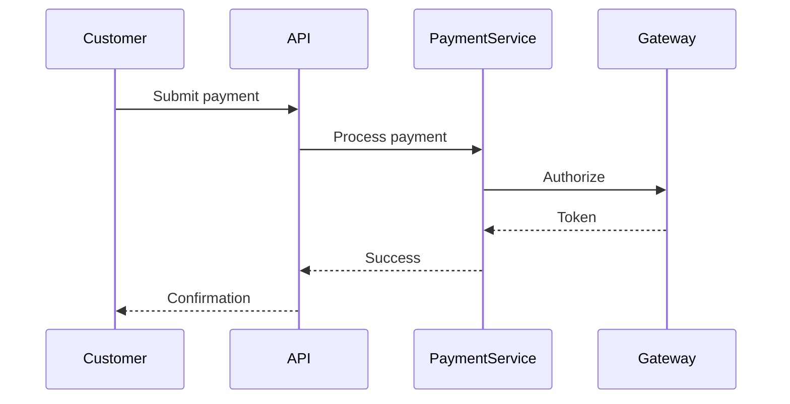

# SpecForged MCP Server

[](https://pypi.org/project/specforged/)
[](https://pypi.org/project/specforged/)
[](https://github.com/whit3rabbit/specforged/actions/workflows/test.yml)

A Model Context Protocol (MCP) server that implements specification-driven development with EARS notation, intelligent mode classification, and structured workflow management.

## ✨ TL;DR: How specforged Works

**SpecForged transforms your AI conversations into structured software development workflows.**

### The Planning Workflow (Guided by Wizard Mode)

**🧙‍♂️ Wizard Mode covers 3 planning phases only:**

1. **Requirements** → Define user stories with EARS notation (5 requirement types)
2. **Design** → Interactive architecture and component planning
3. **Planning** → Auto-generate numbered task hierarchies (1, 1.1, 1.2...)

**⚡ Execution Phase (Separate from Wizard):**

4. **Execution** → Context-aware task implementation with automatic test generation

**IMPORTANT**: The wizard creates specifications and plans, but does NOT implement code. Implementation happens in a separate execution phase with proper context loading and test generation.

### Natural Language Interface

Just talk naturally - specforged understands:
- *"Use specforged to create a new project"* → 🧙‍♂️ **Activates wizard mode**
- *"Create a spec for a user dashboard"* → Starts requirements phase
- *"Mark task 2.1 as done"* → Updates progress, suggests next tasks
- *"How's my progress?"* → Shows completion stats and milestones
- *"What should I work on next?"* → Lists available tasks with context

### 🎯 Key Features

**EARS Requirements** - All 5 patterns supported:
- **Ubiquitous**: THE SYSTEM SHALL always validate inputs
- **Event-Driven**: WHEN user clicks login THE SYSTEM SHALL authenticate
- **State-Driven**: WHILE processing THE SYSTEM SHALL show progress
- **Optional**: WHERE premium enabled THE SYSTEM SHALL unlock features
- **Error-Handling**: IF invalid data THEN THE SYSTEM SHALL show errors

**Smart Task Management**:
- ✅ Auto-complete parent tasks when all subtasks done
- 🔗 Requirement traceability (every task links to user needs)
- 📊 Real-time progress tracking with motivational feedback
- 🎯 Dependency-aware task ordering

**Conversational Workflow**:
- Interactive prompts guide each phase transition
- Natural language commands OR function calls
- Automatic progress updates and celebration
- Built-in coaching for requirement refinement

### 🏗️ Generated Structure

```
specifications/
└── my-dashboard/
    ├── spec.json          # Metadata & status
    ├── requirements.md    # User stories + EARS
    ├── design.md         # Architecture decisions
    └── tasks.md          # Checkbox implementation plan
```

**Perfect for**: Feature specs, API design, project planning, requirement gathering, team alignment, and structured development workflows.

## Quick Start

🎉 **SpecForged is now available on [PyPI](https://pypi.org/project/specforged/)!**

### 🧙‍♂️ Interactive Project Wizard (Recommended)

The fastest way to get started with SpecForged is using the **interactive project wizard** - your guided companion for creating complete specifications:

```bash
# Install specforged
pipx install specforged

# Set up with your LLM (Claude Code, Cursor, etc.)
# Then simply say: "Start specforge wizard for my project"
```

The wizard will guide you through:
1. **Project Setup**: Name, description, and project type
2. **Requirements Gathering**: User stories with EARS notation
3. **Design Phase**: Architecture and component selection
4. **Task Generation**: Automatic implementation plan creation

Available project templates:
- `web-app`: Full-stack web application
- `rest-api`: RESTful API service
- `cli-tool`: Command-line tool
- `python-lib`: Python library
- `microservice`: Microservice architecture

### Quick Installation

```bash
# Install specforged globally with pipx
pipx install specforged

# Verify installation
specforged --version
```

**Choose your integration method:**

- 🔌 See combined setup: **[IDE & Host Integration](#ide--host-integration)**

#### Available Commands

- `specforged`: Run MCP server (default)
- `specforged-http`: Run HTTP server for web integration
- `specforged-cli`: Simplified CLI (same as `specforged`, kept for compatibility)

#### Management

```bash
# Upgrade to latest version
pipx upgrade specforged

# Uninstall
pipx uninstall specforged
```

## Installation for Development

⚠️ **Important**: For local development work, you need MCP servers that can write to your project files. HTTP-based deployments run on remote servers and cannot write to your local project directories.

## Cloud Deployment (Smithery)

SpecForged can be deployed to [Smithery.ai](https://smithery.ai) for cloud-hosted MCP access:

### Configuration Files

The repository includes the required Smithery configuration:

- **`smithery.yaml`**: Container runtime configuration
- **`Dockerfile`**: Multi-stage build with Python + uv
- **HTTP Server**: Streamable HTTP MCP server via `main_http.py`

### Deployment Process

1. **Fork/Clone** this repository to your GitHub account
2. **Connect to Smithery**: Visit [smithery.ai/new](https://smithery.ai/new) and connect your GitHub repo
3. **Deploy**: Click "Deploy" - Smithery will build the Docker container and host the MCP server
4. **Access**: Your server will be available at `https://server.smithery.ai/your-server/mcp`

### Features Available in Cloud Deployment

- ✅ **Mode Classification**: Intelligent routing of user requests
- ✅ **Specification Analysis**: Read and analyze existing specifications
- ✅ **Requirements Guidance**: EARS notation and requirements advice
- ✅ **Workflow Planning**: Task generation and project planning
- ❌ **File Modifications**: Disabled for security (use local installation for development)

### Usage with MCP Clients

Configure your MCP client to use the Smithery-hosted server:

```json
{
  "mcpServers": {
    "specforged": {
      "command": "curl",
      "args": ["-X", "POST", "https://server.smithery.ai/your-server/mcp"],
      "env": {}
    }
  }
}
```

**Recommendation**: Use Smithery deployment for demonstrations and read-only analysis, but prefer local installation (`pipx install specforged`) for active development work.

## IDE & Host Integration

Below are collapsible, focused setup guides. Expand only what you need.

<details>
<summary><strong>Claude Code (recommended for coding)</strong></summary>

The best way to use specforged for active development.

```bash
# Install specforged globally with pipx
pipx install specforged

# Add to Claude Code with project scope (enables team sharing)
claude mcp add --scope=project specforged specforged

# Or for personal use only
claude mcp add specforged specforged
```

Why project scope? It creates a `.mcp.json` in your project root that teammates can reuse:

```json
{
  "mcpServers": {
    "specforged": {
      "command": "specforged",
      "args": [],
      "env": {}
    }
  }
}
```

File access: Claude Code will prompt for permission to write to your project directory.

</details>

<details>
<summary><strong>Cursor IDE</strong></summary>

1) Install specforged: `pipx install specforged`
2) Configure MCP in Cursor settings (Advanced → MCP) or create `.cursor/mcp.json` in your project root.

   - Important: There is no reliable auto-detection of the project folder. You must hardcode the absolute project path via `SPECFORGE_PROJECT_ROOT`.

```json
{
  "mcpServers": {
    "specforged": {
      "command": "specforged",
      "args": [],
      "env": {
        "SPECFORGE_PROJECT_ROOT": "/absolute/path/to/this/project",
        "SPECFORGE_BASE_DIR": ".specifications"
      }
    }
  }
}
```

3) Restart Cursor. 4) Grant local file access when prompted.
5) Because this file lives in the project (`.cursor/mcp.json`), the hardcoded path is per-project.

</details>

<details>
<summary><strong>Windsurf IDE</strong></summary>

1) Install: `pipx install specforged`
2) Configure via Settings → Cascade → Plugins, or edit `~/.codeium/windsurf/mcp_config.json`:

```json
{
  "mcpServers": {
    "specforged": {
      "command": "specforged",
      "args": [],
      "env": {
        "SPECFORGE_PROJECT_ROOT": "/absolute/path/to/your/project",
        "SPECFORGE_BASE_DIR": ".specifications"
      }
    }
  }
}
```

3) Press refresh, then restart Windsurf.
4) Note: Windsurf does not reliably pass your workspace folder as the server CWD. There is no auto-detect. You must hardcode the absolute project path using `SPECFORGE_PROJECT_ROOT` as shown above.
   - If you work across multiple projects, add separate entries (e.g., `specforged-foo`, `specforged-bar`) each with its own `SPECFORGE_PROJECT_ROOT`, or use a small wrapper script that `cd`s into the project before launching `specforged`.

</details>

<details>
<summary><strong>VS Code (Continue/Codeium/etc.)</strong></summary>

1) `pipx install specforged`
2) Add specforged MCP server in your AI extension settings
3) Ensure workspace file permissions are enabled

</details>

<details>
<summary><strong>Claude Desktop</strong></summary>

Note: Best for chat/spec work. For coding, prefer Claude Code.

Install:

```bash
pipx install specforged
```

**Basic Configuration** (`claude_desktop_config.json`):

```json
{
  "mcpServers": {
    "specforged": { "command": "specforged" }
  }
}
```

**Advanced Configuration** (recommended for reliable project detection):

```json
{
  "mcpServers": {
    "specforged": {
      "command": "specforged",
      "args": [],
      "env": {
        "SPECFORGE_PROJECT_ROOT": "/absolute/path/to/your/project",
        "SPECFORGE_BASE_DIR": ".specifications"
      }
    }
  }
}
```

Use the advanced configuration when:
- Working with multiple projects
- Basic config fails to detect your project root correctly
- You need explicit control over where specifications are stored

Config file paths:

- macOS: `~/Library/Application Support/Claude/claude_desktop_config.json`
- Windows: `%APPDATA%\\Claude\\claude_desktop_config.json`
- Linux: `~/.config/Claude/claude_desktop_config.json`

</details>

## Permissions & Path Security

- **Project root = CWD**: specforged treats the server's current working directory as the project root. Run the server from your project folder.
- **Specs location**: Defaults to `./.specifications/` under the project root. You can override by initializing `SpecificationManager(base_dir=Path("./.my-specs"))`.
- **Strict path validation**: All tool paths (e.g., `read_file`, `write_file`, `create_directory`, `edit_block`) are resolved and must remain within the project root. Absolute and relative paths are allowed but are validated against the project root after resolution.
- **No escapes**: Attempts to access files outside the project (e.g., `..`, absolute paths elsewhere, or via symlinks) are rejected.
- **Symlinks**: Paths are fully resolved before validation. Symlinks that point outside the project root are denied.
- **Large files**: Operations on very large files may be warned against or rejected depending on host constraints.
- **IDE prompts**: IDEs/hosts (Claude Code, Windsurf, Cursor, etc.) may prompt for permission before allowing write access to your workspace—accept to enable file creation in `./.specifications/`.

Tip: Keep the server process scoped per-project to avoid writing specs into the wrong project directory.

## Advanced Installation Methods

### Docker with Bind Mounts

For Docker users who want to persist specifications locally:

```bash
# Build the Docker image
docker build -t specforged:latest .
```

Configure in Claude Desktop with bind mount:

```json
{
  "mcpServers": {
    "specforged": {
      "command": "docker",
      "args": [
        "run", "-i", "--rm",
        "--mount", "type=bind,src=/absolute/path/to/host/specifications,dst=/app/specifications",
        "specforged:latest",
        "python", "main.py"
      ]
    }
  }
}
```

**Notes:**
- Container writes to `/app/specifications` which maps to your local directory
- Specifications persist on your local machine
- Restart Claude Desktop after configuration changes

### Manual Development Installation

For development or local testing without pipx:

```bash
# Clone the repository
git clone https://github.com/whit3rabbit/specforged.git
cd specforged

# Install dependencies
pip install -r requirements.txt

# Test locally
python main.py
```

Configure in Claude Desktop:

```json
{
  "mcpServers": {
    "specforged": {
      "command": "python",
      "args": ["/absolute/path/to/specforged/main.py"]
    }
  }
}
```

## Example

```bash
Use specforged to create a spec for a TODO list app that supports creating, editing, completing, and filtering tasks.
```

## Overview

specforged transforms ad-hoc development into a structured process by:
- **Classifying intent** - Routes requests to appropriate handlers (spec mode vs. action mode)
- **Enforcing workflow** - Guides through requirements → design → tasks → execution phases
- **Using EARS notation** - Creates unambiguous, testable requirements
- **Managing artifacts** - Maintains requirements.md, design.md, and tasks.md files

## Background

This server implements the EARS (Easy Approach to Requirements Syntax) notation, developed by Alistair Mavin et al. at Rolls-Royce (2009). EARS is an industry-standard methodology for writing clear, testable requirements, widely used in aerospace, automotive, and safety-critical systems.

## Features

### Intelligent Mode Classification
Automatically determines user intent and routes to appropriate handler:
- **Spec Mode**: Creating specifications, requirements, design documents
- **Do Mode**: Code modifications, commands, implementation tasks
- **Chat Mode**: Questions, explanations, general discussion

### Complete Specification Workflow

#### Requirements Phase
- User stories: "As a [user], I want [goal], so that [benefit]"
- EARS acceptance criteria: "WHEN [condition] THE SYSTEM SHALL [response]"
- Structured requirement tracking with unique IDs

#### Design Phase
- Technical architecture documentation
- Component specifications
- Data models and interfaces
- Sequence diagrams (Mermaid format)
- API contracts and schemas

#### Task Planning
- Discrete, trackable implementation tasks
- Dependency management
- Progress tracking (pending → in_progress → completed)
- Links to requirements for traceability

#### Execution Phase
- Individual task execution with validation
- Real-time status updates
- Progress reporting

### File Management
Automatically generates and maintains three key files per specification:
```
.specifications/
└── your-feature/
    ├── spec.json          # Specification metadata
    ├── requirements.md    # User stories & EARS criteria
    ├── design.md         # Technical architecture
    └── tasks.md          # Implementation plan
```

## Usage

### Interactive Project Wizard (Recommended)

The quickest way to create comprehensive specifications is through conversation with your LLM:

```
User: "Start specforge wizard for my task management app"

LLM: 🎉 Project 'task-management-app' created! I'm ready to guide you through
     the requirements phase. Let's start by understanding your users and their
     needs. What kind of system are you building and who will use it?

User: "It's for team collaboration, users need to create and assign tasks"

LLM: Great! Let me help you create user stories. I'll use add_requirement() to
     add this to your specification...
```

The wizard guides you conversationally through:
1. **Requirements**: Define user stories with EARS acceptance criteria
2. **Design**: Document system architecture and components
3. **Planning**: Generate implementation tasks automatically
4. **Execution**: Track progress as tasks are completed

**Wizard Features:**
- **Guided Requirements**: Step-by-step user story creation with EARS notation help
- **Architecture Templates**: Pre-built patterns for common project types
- **Smart Task Generation**: Automatic breakdown from requirements to implementable tasks
- **Progress Tracking**: Generated tasks in checkbox format for easy progress monitoring
- **Professional Output**: Creates complete specification with requirements.md, design.md, and tasks.md

### Wizard Mode via MCP (Planning Only - Automatic Activation)

specforged can automatically activate wizard mode through natural language when using MCP integration:

#### Auto-Activation Triggers

The wizard automatically starts when:
- **No .specifications folder exists** in your project
- **Using "specforged" keyword** in requests
- **First-time setup** is detected

```bash
# These phrases trigger wizard mode automatically (PLANNING ONLY):
"Use specforged to create a new project specification"
"Start specforge wizard for my application"
"Create a new spec with specforged for payment processing"
"I need specforged to help set up my project"
"Launch the specforged wizard for user management"
"Use specforged wizard mode to design my API"
```

**⚠️  Important**: The wizard creates specifications but does NOT implement tasks. It guides you through Requirements → Design → Planning phases only.

**Pro Tip**: Just say "specforged" in your request and the wizard will activate if no specifications exist in your project!

#### Three-Phase Planning Workflow (Wizard Mode)

When wizard mode activates, you'll be guided through **PLANNING ONLY**:

1. **📝 Phase 1: Requirements Gathering**
   - Interactive user story creation
   - EARS notation assistance and examples
   - Creates `requirements.md` with structured stories
   - Real-time validation and suggestions

2. **🎨 Phase 2: System Design**
   - Architecture pattern selection
   - Component definition wizard
   - Data model creation help
   - Creates `design.md` with technical specifications

3. **✅ Phase 3: Task Generation**
   - Automatic breakdown from requirements to tasks
   - Dependency analysis and ordering
   - Creates `tasks.md` with checkbox format
   - Progress tracking setup

#### ⚡ Execution Phase (After Wizard Completion)

**The wizard does NOT execute tasks.** Implementation happens separately with:

- **Context Loading**: Automatically reads requirements.md and design.md before each task
- **Architecture Compliance**: Ensures implementation follows the planned design
- **EARS Validation**: Verifies acceptance criteria are met
- **Test Generation**: Auto-generates test templates for each completed task
- **Quality Assurance**: Validates implementation against specifications

#### Example Wizard Session

```
User: Use specforged to create a specification for user authentication

Claude: I'll start the specforged wizard to create a comprehensive specification.

📝 Phase 1/3: Requirements Gathering
• Created user story: "As a user, I want secure login..."
• Added EARS requirements with validation patterns
• Generated requirements.md ✅

🎨 Phase 2/3: System Design
• Selected MVC architecture pattern
• Defined AuthService and UserController components
• Created data models for User and Session entities
• Generated design.md ✅

✅ Phase 3/3: Task Generation
• Analyzed requirements and created 12 implementation tasks
• Established dependency relationships
• Generated tasks.md with checkbox format ✅

🎉 Complete specification created at: ./.specifications/user-authentication/
```

### Manual Specification Creation (MCP)

For experienced users or specific workflows, you can create specifications manually:

```
User: Create a spec for user authentication system
Response: Creates new specification with requirements.md, design.md, and tasks.md files
```

### Mode Classification Examples

```python
# Spec mode - Wizard activation (high priority)
"Use specforged to create a new project specification"
"Start specforge wizard for user management"
"Create a spec with specforged for payment processing"
"I need specforged to set up my API specification"

# Spec mode - Standard specification creation
"Create a spec for payment processing"
"Generate a specification for the login system"
"Execute task 3.2 from user-auth spec"
"Add a requirement to the auth spec"

# Do mode (code/action requests)
"Fix the syntax error in app.js"
"Run the test suite"
"Deploy to production"

# Chat mode (questions/explanations)
"What is EARS notation?"
"How do promises work?"
"Explain the architecture"
```

## Triggering MCP Commands

specforged integrates with Claude Desktop and other MCP hosts through natural language interactions. The system automatically classifies your input and routes requests to appropriate tools based on context and intent.

### Command Patterns

**Specification Management:**
- "Create a spec for [feature name]"
- "List all specifications"
- "Show details for [spec-id]"

**Requirements and Design:**
- "Add a requirement to [spec-id] as a [user type]..."
- "Update the design for [spec-id] with [architecture details]"

**Task Management (Checkbox Style):**
- "Generate implementation plan for [spec-id]"
- "Check off task 1.2 in [spec-id]"
- "Mark tasks 1.1, 1.2, and 2.1 as complete"
- "What tasks are ready to work on?"
- "Show progress summary for [spec-id]"

**General Queries:**
- "What is EARS notation?"
- "Explain the workflow phases"

The system will automatically invoke the appropriate MCP tools based on your natural language input.

### Available Tools

### Multi-Specification Context Management

SpecForged now supports managing multiple specifications in a single project with **current specification context**—like a current working directory for specs.

**Key Features:**
- **Current Spec Context**: Set an active specification to work with
- **Custom Spec IDs**: Create specs with meaningful names (`frontend`, `api-v2`, etc.)
- **Context Switching**: Seamlessly switch between different specs
- **Simplified Commands**: Most tools no longer require `spec_id` parameter

**Context Management:**
```bash
# Create specs with custom IDs
create_spec(name="Frontend Development", spec_id="frontend")
create_spec(name="API Refactor", spec_id="api-v2")

# Switch context (like 'cd' for specifications)
set_current_spec(spec_id="frontend")

# Work without specifying spec_id (uses current context)
add_requirement(as_a="user", i_want="to login", so_that="I can access my account")
update_design(architecture="React + TypeScript")
generate_implementation_plan()
check_task(task_number="1.1")

# List specs shows which is current
list_specifications()  # Shows is_current: true for active spec
```

| Tool | Description | Parameters |
|------|-------------|------------|
| `classify_mode` | Classify user input intent | `user_input` |
| `create_spec` | Create new specification | `name`, `description`, `[spec_id]` |
| `set_current_spec` | **NEW** Set active specification | `spec_id` |
| `add_requirement` | Add user story with EARS criteria | `as_a`, `i_want`, `so_that`, `[spec_id]`, `[ears_requirements]` |
| `update_design` | Update technical design | `[spec_id]`, `[architecture]`, `[components]`, `[data_models]`, `[sequence_diagrams]` |
| `generate_implementation_plan` | Create task hierarchy from requirements | `[spec_id]` |
| `update_implementation_plan` | Refresh plan preserving completion status | `[spec_id]` |
| `check_task` | Mark task as completed | `task_number`, `[spec_id]` |
| `uncheck_task` | Mark task as pending | `task_number`, `[spec_id]` |
| `bulk_check_tasks` | Check multiple tasks at once | `task_numbers`, `[spec_id]` |
| `get_task_details` | Get detailed task information | `task_number`, `[spec_id]` |
| `get_next_available_tasks` | Find tasks ready to work on | `[spec_id]` |
| `get_task_status_summary` | Complete progress overview | `[spec_id]` |
| `add_implementation_task` | Add individual task to plan | `title`, `description`, `[spec_id]`, `[dependencies]`, `[subtasks]` |
| `execute_task` | Execute a specific task | `task_id`, `[spec_id]` |
| `transition_workflow_phase` | Move to next phase | `target_phase`, `[spec_id]` |
| `list_specifications` | List all specs (shows current) | - |
| `get_specification_details` | Get spec details | `spec_id`, `[include_content]` |

*Parameters in `[brackets]` are optional. When `spec_id` is omitted, the current specification context is used.*

### Filesystem Tools (Project-Scoped)

| Tool | Description | Parameters |
|------|-------------|------------|
| `create_directory` | Create a directory within project root | `path`, `exist_ok` |
| `read_file` | Read a UTF-8 text file within project root | `path` |
| `write_file` | Write/append a UTF-8 text file within project root | `path`, `content`, `mode` |
| `edit_block` | Safely replace exact text in a file | `file_path`, `old_string`, `new_string`, `expected_replacements` |

These tools operate only within your current project directory (the server's CWD). Any path outside the project root is rejected.

```bash
# Create specs directory (if you want to initialize manually)
create_directory(path=".specifications")

# Create files
write_file(path=".specifications/requirements.md", content="# Requirements")
write_file(path="README.md", content="\nExtra line\n", mode="append")

# Read a file
read_file(path="src/main.py")

# Safe in-place edit
edit_block(
  file_path="src/main.py",
  old_string="print('Hello')",
  new_string="print('Hello, World!')",
  expected_replacements=1
)
```

### EARS Notation Examples

EARS (Easy Approach to Requirements Syntax) provides clear, testable requirements:

```markdown
WHEN a user submits valid credentials
THE SYSTEM SHALL authenticate and create a session

WHILE processing a payment
THE SYSTEM SHALL display a progress indicator

WHERE two-factor authentication is enabled
THE SYSTEM SHALL require a verification code

IF the session expires
THEN THE SYSTEM SHALL redirect to login
```

### Complete Workflow Example

This shows how natural language prompts trigger MCP commands behind the scenes:

| Natural Language Prompt | MCP Command Triggered |
|--------------------------|----------------------|
| *"Create a spec for payment processing with ID 'payments'"* | `create_spec(name="Payment Processing", description="Handle customer payments", spec_id="payments")` |
| *"Create a spec for user authentication with ID 'auth'"* | `create_spec(name="User Authentication", description="Handle user authentication", spec_id="auth")` |
| *"Add a requirement: As a customer, I want to pay with multiple methods..."* | `add_requirement(as_a="customer", i_want="to pay with multiple methods", so_that="I can choose my preferred payment option", ears_requirements=[...])` |
| *"Update the design with microservices architecture"* | `update_design(architecture="Microservices with payment gateway integration", components=[...])` |
| *"Generate the implementation plan"* | `generate_implementation_plan()` |
| *"Switch to the auth spec"* | `set_current_spec(spec_id="auth")` |
| *"Add a login requirement"* | `add_requirement(as_a="user", i_want="to login securely", so_that="I can access my account")` |
| *"Switch back to payments"* | `set_current_spec(spec_id="payments")` |
| *"Mark task 1 as complete"* | `check_task(task_number="1")` |
| *"Complete task 2.1"* | `check_task(task_number="2.1")` |
| *"How's my progress?"* | `get_task_status_summary()` |
| *"Show all my specifications"* | `list_specifications()` |
| *"Mark tasks 3.1, 3.2, and 4.1 as done"* | `bulk_check_tasks(task_numbers=["3.1", "3.2", "4.1"])` |

### Key Benefits of Natural Language Interface

- **No need to remember exact function names** - just describe what you want
- **Context-aware responses** - the system understands which spec you're working on
- **Flexible phrasing** - multiple ways to express the same intent
- **Automatic parameter inference** - many parameters filled from context

## File Structure

### requirements.md
```markdown
# Requirements for Payment Processing

## User Story US-001

**As a** customer,
**I want** to pay with multiple methods,
**So that** I can choose my preferred payment option

### Acceptance Criteria (EARS Format)

- [US-001-R01] WHEN a customer selects credit card THE SYSTEM SHALL display secure card entry form
- [US-001-R02] IF payment fails THEN THE SYSTEM SHALL show error and suggest alternatives
```

### design.md
```markdown
# Technical Design for Payment Processing

## System Architecture

Microservices architecture with API gateway and payment provider integration...

## Components

### PaymentService
Core service handling payment orchestration...

### GatewayAdapter
Adapter pattern implementation for multiple payment providers...

## Data Models

```typescript
interface Payment {
  id: string;
  amount: number;
  currency: string;
  method: PaymentMethod;
  status: PaymentStatus;
}
```

## Sequence Diagrams


```

### tasks.md
```markdown
# Implementation Plan

## Progress Summary

- **Total Tasks:** 8
- **Completed:** 2
- **In Progress:** 1
- **Pending:** 5
- **Progress:** 37.5%

- [x] 1. Set up project structure
  - Initialize project with required dependencies
  - _Requirements: US-001-R01_

- [ ] 2. Implement payment service API
  - [ ] 2.1. Create API endpoints
    - Build RESTful endpoints for payment processing
    - _Requirements: US-001-R01, US-001-R02_
  - [x] 2.2. Add authentication middleware
    - Implement JWT-based authentication
    - _Requirements: US-001-R03_

- [ ] 3. Build payment gateway integration
  - Integrate with external payment providers
  - _Requirements: US-002-R01_
```

## Resources

The server provides MCP resources for accessing specification files:

- `spec://{spec_id}/requirements` - Get requirements.md content
- `spec://{spec_id}/design` - Get design.md content
- `spec://{spec_id}/tasks` - Get tasks.md content

## Configuration Options

Customize the server by modifying these settings in the Python file:

```python
# By default, specforged uses ./.specifications under your project root.
# To override the specifications directory:
spec_manager = SpecificationManager(base_dir=Path("./.my-specs"))

# Adjust mode classification weights
classifier.spec_patterns = [
    (r'your_pattern', weight),
    # Add custom patterns
]
```

## Development

### Project Structure
```
specforged/
├── src/
│   ├── models/          # Data models and enums
│   ├── core/           # Core business logic
│   ├── tools/          # MCP tool implementations
│   ├── resources.py    # MCP resource handlers
│   ├── prompts.py      # MCP prompt definitions
│   └── server.py       # Main server factory
├── tests/              # Comprehensive test suite
├── scripts/            # Development helper scripts
├── main.py             # Local CLI entry point
└── requirements.txt    # Dependencies
```

### Development Commands
```bash
# Run local MCP server
python main.py

# Install dependencies
pip install -r requirements.txt

# Run tests
python -m pytest tests/

# Run linting and formatting
python scripts/dev.py lint
python scripts/dev.py format

# Run all quality checks
python scripts/dev.py all
```

### Running Tests
```bash
python -m pytest tests/
```

### Contributing
1. Fork the repository
2. Create a feature branch
3. Make your changes
4. Run tests and linting: `python scripts/dev.py all`
5. Submit a pull request

### Adding Custom Patterns

Extend the mode classifier with domain-specific patterns:

```python
# Add to spec_patterns for specification detection
(r'\b(?:epic|feature)\s+definition', 0.8)

# Add to do_patterns for action detection
(r'\b(?:migrate|backup|restore)\s+database', 0.85)
```

## Troubleshooting

### Common Issues

**Server not appearing in Claude Desktop**
- Ensure absolute paths in configuration
- Check Python is in PATH
- Restart Claude Desktop after config changes

**Mode classification incorrect**
- Check classifier confidence scores with `classify_mode` tool
- Add custom patterns for your domain
- Default is "do mode" when confidence is low

**Files not generating**
- Check write permissions in .specifications directory
- Ensure all phases are properly transitioned
- Verify spec_id matches existing specification
- Ensure you start the server from your project directory (CWD becomes the project root)

## License

MIT License - See LICENSE file for details

## Acknowledgments

- EARS notation methodology by Alistair Mavin et al. (Rolls-Royce, 2009)
- FastMCP framework by Jonathan Lowin
- Inspired by specification-driven development practices

## References

- [EARS Paper - IEEE RE Conference](https://ieeexplore.ieee.org/document/5328509)
- [FastMCP Documentation](https://github.com/jlowin/fastmcp)
- [Model Context Protocol Specification](https://modelcontextprotocol.io)
