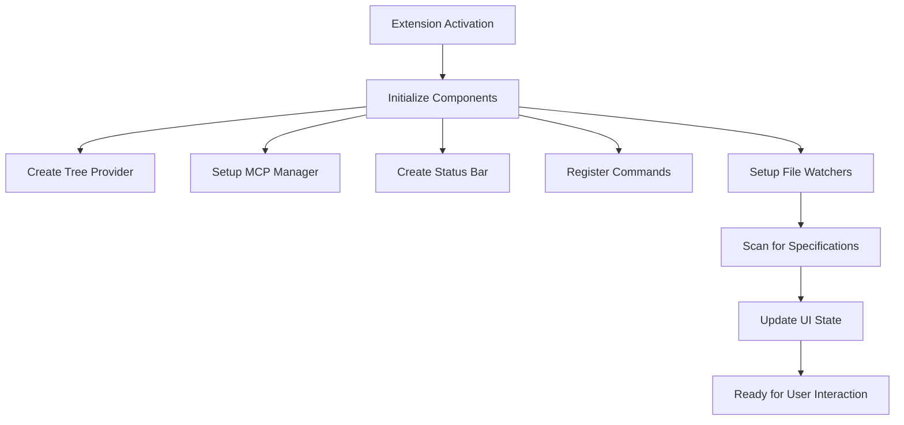

# SpecForged VS Code Extension Architecture

## Overview

The SpecForged VS Code extension provides a comprehensive interface for specification-driven development using the SpecForged MCP server. It integrates seamlessly with VS Code's UI paradigms while providing specialized functionality for managing EARS-formatted requirements, technical designs, and implementation tasks.

## Core Architecture

### Extension Lifecycle



### Component Hierarchy

```
Extension (extension.ts)
├── SpecificationManager (utils/specificationManager.ts)
│   └── SpecParser (utils/specParser.ts)
├── SpecProvider (providers/specProvider.ts)
│   └── SpecTreeView (views/specTreeView.ts)
├── McpManager (mcp/mcpManager.ts)
│   └── McpSetupWizard (mcp/mcpSetup.ts)
├── StatusBarManager (utils/statusBarManager.ts)
├── SpecWebview (views/specWebview.ts)
└── Commands (commands/index.ts)
```

## Key Components

### 1. SpecificationManager

**Responsibility**: File system operations and specification discovery
**Location**: `src/utils/specificationManager.ts`

- Scans workspace for `.specifications` and `specifications` directories
- Manages specification file lifecycle (create, read, update)
- Provides workspace-scoped file access with security validation
- Caches parsed specifications for performance

```typescript
interface SpecificationManager {
    refresh(): Promise<void>
    getSpecifications(): ParsedSpecification[]
    getSpecification(id: string): ParsedSpecification | undefined
    openSpecificationFile(specId: string, fileName: string): Promise<void>
    createSpecificationDirectory(workspaceFolder: WorkspaceFolder): Promise<Uri>
}
```

### 2. SpecProvider (Tree Data Provider)

**Responsibility**: VS Code tree view integration
**Location**: `src/providers/specProvider.ts`

- Implements VS Code's `TreeDataProvider` interface
- Provides hierarchical view: Specs → Phases → Tasks
- Handles lazy loading and dynamic updates
- Manages tree item states and context menus

### 3. McpManager

**Responsibility**: MCP server integration and configuration
**Location**: `src/mcp/mcpManager.ts`

- Detects installed IDEs (Cursor, Windsurf, Claude Desktop, VS Code)
- Manages SpecForged MCP server installation via pipx
- Generates IDE-specific configuration files
- Handles environment variables and path resolution

### 4. StatusBarManager

**Responsibility**: Status bar integration and user feedback
**Location**: `src/utils/statusBarManager.ts`

- Shows current specification and progress
- Displays MCP server connection status
- Provides quick actions and notifications
- Updates periodically with real-time information

### 5. SpecWebview

**Responsibility**: Rich specification display
**Location**: `src/views/specWebview.ts`

- Renders specifications with EARS syntax highlighting
- Provides tabbed interface for Requirements, Design, Tasks
- Handles interactive task completion
- Supports responsive design and VS Code theming

## Data Models

### Core Specification Model

```typescript
interface Specification {
    id: string
    name: string
    description: string
    status: SpecStatus
    phase: WorkflowPhase
    created_at: string
    updated_at: string
    user_stories: UserStory[]
    tasks: Task[]
    is_current: boolean
}

interface Task {
    id: string
    title: string
    description: string
    status: 'pending' | 'in_progress' | 'completed'
    task_number: string              // Hierarchical: "1.2.3"
    dependencies: string[]
    subtasks: Task[]
    linked_requirements: string[]
    estimated_hours: number
    actual_hours: number
}
```

### EARS Requirements Model

```typescript
interface EARSRequirement {
    id: string
    condition: string               // WHEN/WHILE/WHERE/IF
    system_response: string         // THE SYSTEM SHALL
    priority: 'HIGH' | 'MEDIUM' | 'LOW'
    acceptance_criteria: string[]
}

interface UserStory {
    id: string
    as_a: string                   // As a [user]
    i_want: string                 // I want [goal]
    so_that: string               // So that [benefit]
    requirements: EARSRequirement[]
}
```

## File System Structure

The extension works with the following file structure:

```
project-root/
└── .specifications/               # Default spec directory
    ├── spec-name-1/              # Individual specification
    │   ├── spec.json             # Metadata and configuration
    │   ├── requirements.md       # User stories and EARS requirements
    │   ├── design.md            # Technical architecture
    │   └── tasks.md             # Implementation plan (checkbox format)
    └── spec-name-2/
        ├── spec.json
        ├── requirements.md
        ├── design.md
        └── tasks.md
```

## Command System

### Primary Commands

| Command | Function | Scope |
|---------|----------|--------|
| `specforged.initialize` | Project setup wizard | Global |
| `specforged.createSpec` | Create new specification | Global |
| `specforged.setupMcp` | Configure MCP servers | Global |
| `specforged.toggleTask` | Toggle task completion | Spec-specific |
| `specforged.showCurrentSpec` | Display current spec info | Global |

### File Operations

| Command | Function | Parameters |
|---------|----------|------------|
| `specforged.openRequirements` | Open requirements.md | specId |
| `specforged.openDesign` | Open design.md | specId |
| `specforged.openTasks` | Open tasks.md | specId |

## UI Integration Points

### Activity Bar

- Custom SpecForged icon
- Badge showing specification count
- Always visible when specifications detected

### Tree View

```
📁 SPECS
├── 📄 user-authentication
│   ├── 📋 Requirements (3 stories)
│   ├── 🎨 Design
│   └── ✅ Tasks (8/12 completed)
│       ├── ✅ 1. Setup project structure
│       ├── ⬜ 2. Implement authentication
│       │   ├── ✅ 2.1. Create login form
│       │   └── ⬜ 2.2. Add JWT validation
│       └── ⬜ 3. Add session management
```

### Status Bar (Left Side)

```
$(book) user-authentication  $(check) MCP  $(circle-three-quarter) 75%
```

### Context Menus

- **Specification**: Open Requirements, Open Design, Open Tasks
- **Task**: Toggle Status, View Details
- **Phase**: Open File, View Progress

## Security Model

### File System Access

- All file operations scoped to workspace directories
- Path validation prevents directory traversal attacks
- Symlink resolution with safety checks
- Size limits on file operations (10MB default)

### MCP Configuration

- Configuration files written to user/project directories only
- Environment variables validated before use
- No arbitrary command execution
- IDE detection uses safe system checks

## Performance Optimizations

### Lazy Loading

- Specifications parsed only when accessed
- Tree view items loaded on-demand
- Webviews created only when needed

### Caching Strategy

- Parsed specifications cached in memory
- File modification time tracking
- Invalidation on file system changes

### Resource Management

- File watchers scoped to specification directories
- Webviews disposed when not visible
- Status bar updates throttled to 30-second intervals

## Extension Points

### Configuration

```json
{
  "specforged.autoDetect": true,
  "specforged.specFolder": ".specifications",
  "specforged.mcpServerPath": "specforged",
  "specforged.defaultIde": "auto"
}
```

### Activation Events

```json
{
  "activationEvents": [
    "workspaceContains:**/.specifications/**",
    "workspaceContains:**/specifications/**",
    "onCommand:specforged.initialize"
  ]
}
```

## Error Handling

### Graceful Degradation

- Missing SpecForged server → Setup wizard
- No specifications found → Initialize project option
- File parsing errors → Show error with retry option
- MCP configuration failures → Detailed error messages

### User Feedback

- Progress notifications for long-running operations
- Status bar indicators for system state
- Contextual error messages with suggested actions

## Testing Strategy

### Unit Tests

- Model parsing and validation
- File system operations
- Command registration and execution

### Integration Tests

- Tree view provider functionality
- MCP manager operations
- Status bar updates

### Extension Tests

- VS Code API integration
- Command palette integration
- File watcher behavior

## Future Architecture Considerations

### Extensibility

- Plugin system for custom specification formats
- Theme support for webview rendering
- Custom task types and validation rules

### Performance

- Virtual scrolling for large specification lists
- Background parsing with web workers
- Incremental updates for file changes

### Collaboration

- Real-time specification sharing
- Conflict resolution for concurrent edits
- Version control integration hooks
